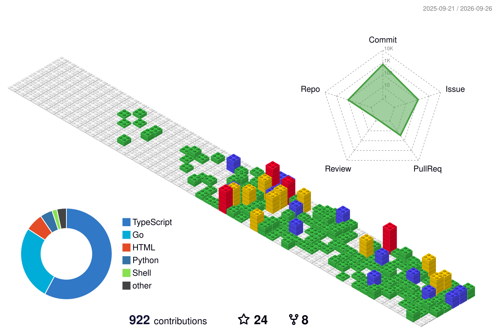

<!-- Badges + counters -->

  
  

  
  
  

  

---

## The Short Version

Self-taught developer who walked the full path: **manual testing → QA automation → full-stack engineering**. I build tools that make teams faster, and I'm now revisiting everything I've learned through the lens of AI.

<table>
  <tr>
    <td align="center" width="25%"><strong>QA → Full-Stack</strong> end-to-end journey</td>
    <td align="center" width="25%"><strong>Productivity Tools</strong> that teams actually use</td>
    <td align="center" width="25%"><strong>AI-Augmented</strong> revisiting everything</td>
    <td align="center" width="25%"><strong>Cross-Functional</strong> collaboration first</td>
  </tr>
</table>

**What I bring to the table:**

- **QA & Test Engineering** — automation frameworks, test strategy, quality gates, CI/CD integration. I know what breaks because I spent years finding it.
- **Full-Stack Development** — Python, TypeScript, Go backends; React frontends; database design; API architecture. Shipping, not just prototyping.
- **Productivity Tooling** — custom developer tools, workflow automation, internal frameworks that reduce friction for entire teams.
- **AI Integration** — applying AI to daily workflows, building AI-enhanced development tools, and exploring how intelligent systems change software quality.

---

## Sample Project

> Below is a sample showing how to present a featured project. Replace with your own.

### Math-To-Manim

**Ask a question -> get a computed mathematical film.** Nothing keyframed -- every frame is integrated, simulated, or derived. 2,400+ stars.

<table>
  <tr>
    <td width="33%">
      
      
<strong>The Traitor Axis</strong> Rigid-body chaos from RK4 integration

    </td>
    <td width="33%">
      
      
<strong>The Last Day</strong> One continuous 3D take

    </td>
    <td width="33%">
      
      
<strong>Vortex Leapfrog</strong> Biot-Savart integration

    </td>
  </tr>
</table>

  
  

> *This is a reference example from [HarleyCoops](https://github.com/HarleyCoops). Replace this section with your own project showcase -- GIFs, screenshots, and technical descriptions work best.*

---

## Featured Projects

<!-- Replace the projects below with your own -->

### AI-Enhanced Development
| Project | What it does |
|---|---|
| *Your AI project here* | *Description* |

### QA & Productivity Tools
| Project | What it does |
|---|---|
| *Your QA tool here* | *Description* |

### Small Business Solutions
| Project | What it does |
|---|---|
| *Your biz tool here* | *Description* |

### Personal Infrastructure
| Project | What it does |
|---|---|
| *Your infra project here* | *Description* |

  <!-- Pin your best repos here -->
  <!--
  
  -->

---

## Tech Stack

  

  
  
  
  
  
  

---

## Tech Wire

*Live -- refreshed every 6 hours by a GitHub Action from dev community feeds.*

<!-- NEWS:START -->
| Category | Date | Headline |
|----------|------|----------|
| Tech | Thu, 03 Sep 202 | [Codex Is Down](https://github.com/openai/codex/issues/28756) |
| Tech | Thu, 03 Sep 202 | [Any Human Ever – One life, drawn at random from all who have ever lived](https://anyhumanever.com/) |
| Tech | Thu, 03 Sep 202 | [ChatGPT Is Throwing 404](https://chatgpt.com/) |
| Tech | Thu, 03 Sep 202 | [Astronomers Detect a 10-Sided Structure in Saturn's Atmosphere](https://www.sciencealert.com/astronomers-spot-an-uncannily-geometric-10-sided-structure-in-saturns-atmosphere) |
| Tech | Thu, 03 Sep 202 | [Elevated Errors for Multiple Models](https://status.claude.com/incidents/461yvfrzpwtt) |
| Dev | Thu, 03 Sep 202 | [Free open-source avatar resources for developers and designers👋](https://dev.to/simran_singh_836b353245fb/free-open-source-avatar-resources-for-developers-and-designers-3ck5) |
| Dev | Thu, 03 Sep 202 | [How pdlc-skills Keeps Quality Up When AI Writes the Code](https://dev.to/kanfu-panda/how-pdlc-skills-keeps-quality-up-when-ai-writes-the-code-42fk) |
| Dev | Thu, 03 Sep 202 | [AI Systems Need Runtime Budgets](https://dev.to/lukaswalter/ai-systems-need-runtime-budgets-43fc) |
| Dev | Thu, 03 Sep 202 | [Our signature verifier passed CI by never running](https://dev.to/rehman_ahmadchaudhry_007/our-signature-verifier-passed-ci-by-never-running-ipm) |
| Dev | Thu, 03 Sep 202 | [Commit Your Code tip](https://dev.to/jarvisscript/commit-your-code-tip-b5k) |

<!-- NEWS:END -->

---

## Latest Posts

<!-- BLOG:START -->
*Blog posts will appear here after configuring your RSS feed in `.github/scripts/update_blog.py`*
<!-- BLOG:END -->

---

## GitHub Analytics

  
<strong>Open stats dashboards</strong>

  

    
  

  

    
    
  

  

    
  

  

    
  

---

## Connect

  <a href="https://github.com/qdriven">GitHub</a> ·
  <a href="https://linkedin.com/in/qdriven">LinkedIn</a>

<em>Every project is a lesson documented. The best entry points are the project READMEs and code linked above.</em>

  

